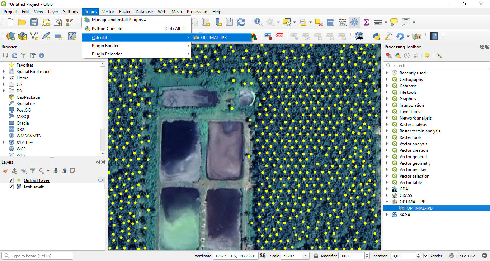
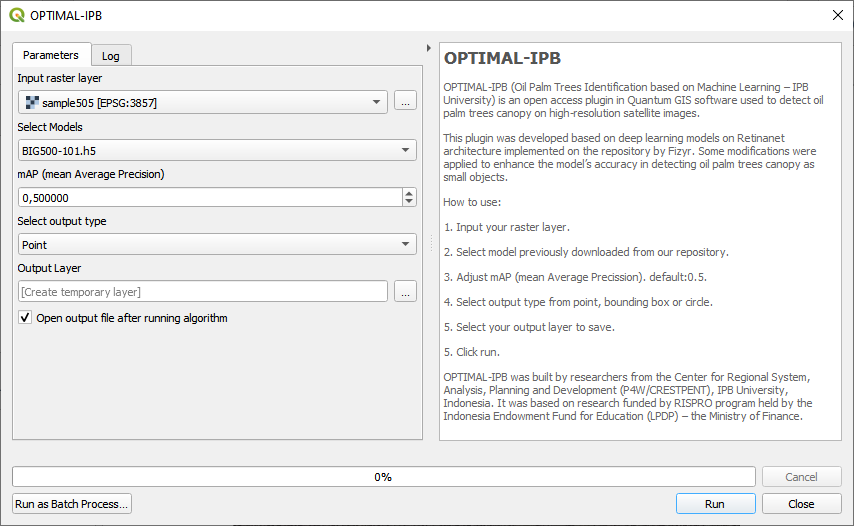
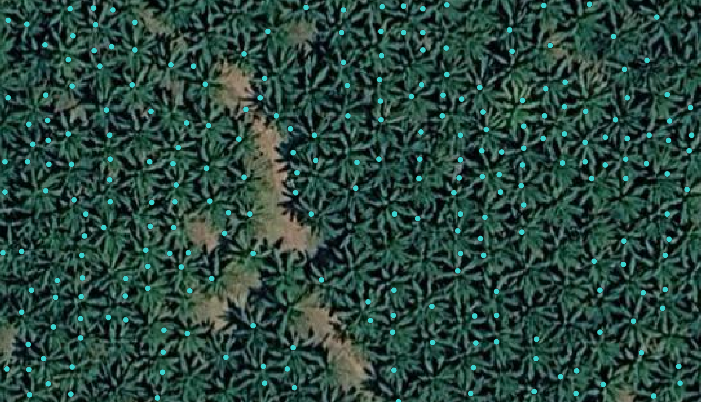
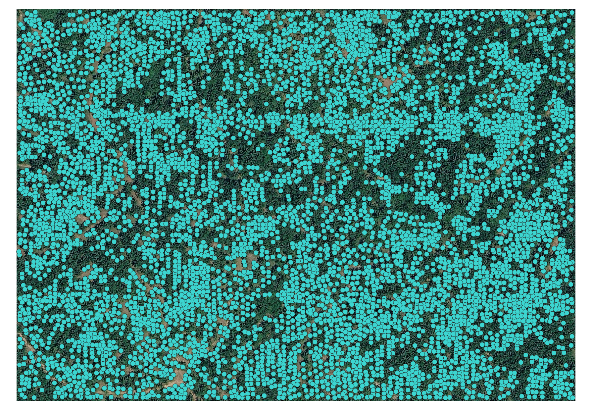
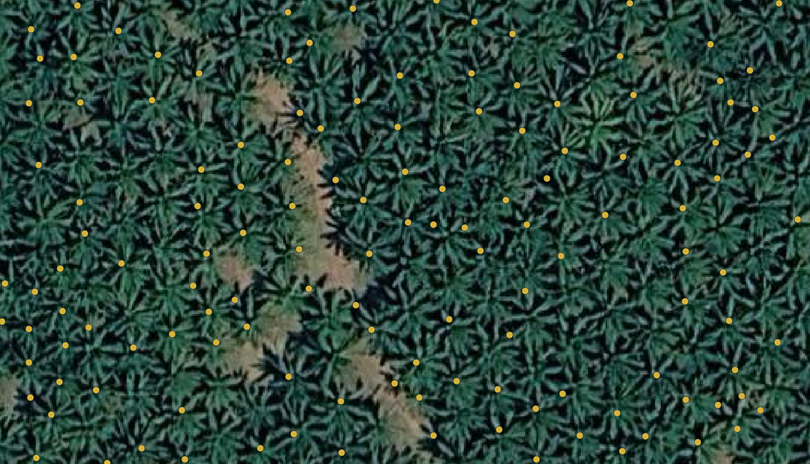
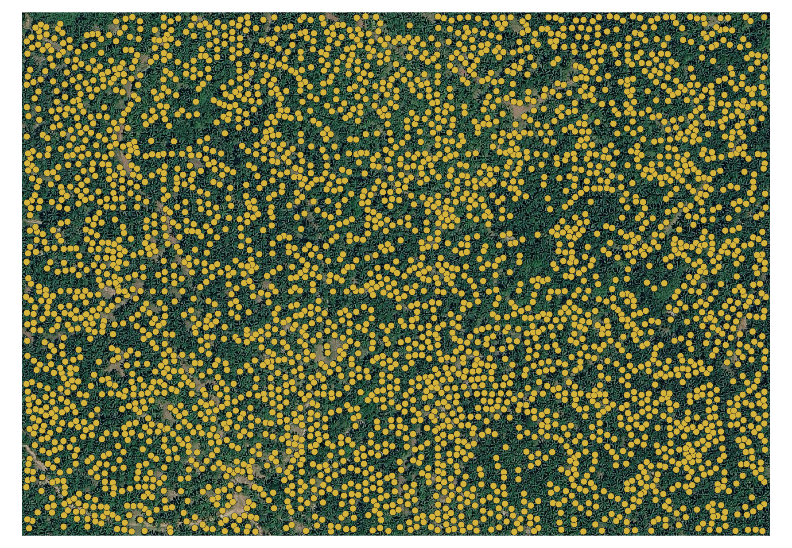
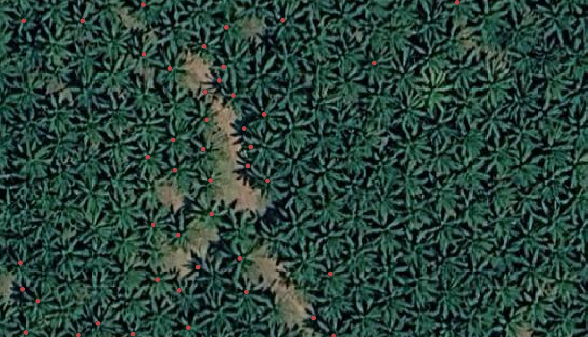

# OPTIMAL-IPB

OPTIMAL-IPB (Oil Palm Trees Identification based on Machine Learning – IPB University) is an open access plugin in Quantum GIS software used to detect oil palm trees canopy on high-resolution satellite images. This plugin was developed based on deep learning models on Retinanet architecture implemented on the repository by [Fizyr](https://github.com/fizyr/keras-retinanet). Some modifications were applied to enhance the model’s accuracy in detecting oil palm trees canopy as small objects. OPTIMAL_IPB was built by researchers from the [Center for Regional System, Analysis, Planning and Development (P4W/CRESTPENT)](https://p4w.ipb.ac.id), IPB University, Indonesia. It was based on research funded by RISPRO program held by the [Indonesia Endowment Fund for Education (LPDP)](https://lpdp.kemenkeu.go.id/) – the Ministry of Finance.

## Installation Steps

:warning: This plugin was developed in python 3.7 environment contained in QGIS version 3.10 A Coruña, and works with keras version 2.4.3 and tensorflow version 2.3.0.

### 1. Package Required

Some packages need to be installed in the QGIS environment first. There are two ways to install packages in the QGIS environment.

#### - Package installation via python console in QGIS

Open python console in QGIS and run `import pip` then `pip.main(['install', '-q', '--disable-pip-version-check', 'scipy==1.4.1', 'cython', 'keras-resnet', 'opencv-python', 'pillow', 'progressbar2', 'tensorflow==2.3.0', 'keras==2.4.3', 'numpy==1.18.5', 'protobuf==3.15.8'])` to install all the prerequisites.

#### - Module installation via OSGeo4W Shell

Open OSGeo4W Shell then run this command `pip install scipy==1.4.1 cython keras-resnet opencv-python pillow progressbar2 tensorflow==2.3.0 keras==2.4.3 numpy==1.18.5 protobuf==3.15.8`

### 2. GPU Configuration (Optional)
This plugin is built using tensorflow as a machine learning framework. For faster process, it is highly recommended to use a GPU. You can find complete instructions for GPU Support through [this link](https://www.tensorflow.org/install/gpu#software_requirements).

For Windows user, we need to add the CUDA®, CUPTI, and cuDNN installation directories to the %PATH% environmental variable on QGIS. Click `Settings > Options`, on the System Tab choose `Environment` then check `Use custom variables (restart required - include separators)`.

Click Plus (+) button, then add configuration bellow:

- `Apply: Prepend`
- `Variable: PATH`
- `Value: C:\Program Files\NVIDIA GPU Computing Toolkit\CUDA\v10.1\bin;C:\Program Files\NVIDIA GPU Computing Toolkit\CUDA\v10.1\extras\CUPTI\lib64;C:\Program Files\NVIDIA GPU Computing Toolkit\CUDA\v10.1\include;`

### 3. Plugin Installation
There are two ways to install this plugin.
1. From official QGIS Plugin Repository - Use the QGIS Plugins menu to install the OPTIMAL-IPB Plugin (see [QGIS manual](http://docs.qgis.org/latest/en/docs/user_manual/plugins/plugins.html)).
2. From [Zipfile](https://github.com/p4wlppmipb/OPTIMAL-IPB/archive/master.zip) of this repository. Then follow this [instruction](http://docs.qgis.org/latest/en/docs/user_manual/plugins/plugins.html#the-install-from-zip-tab).

### 4. Pick a Model

There are three models that have been trained using Backbone Resnet101. You can download the three models in the table below:
| Satellite Imagery Paltform  | mAP@0.5 | Model (inference) |
| --------------------------- | ------- | -------------------- |
| Pleiades Satellite Imagery  | 0.903   | [Pleiades-Resnet101.h5](https://github.com/p4wlppmipb/OPTIMAL-IPB/releases/download/0.1/Pleiades-Resnet101.h5) |
| Geoeye Satellite Imagery    | 0.900   | [Geoeye-Resnet101.h5](https://github.com/p4wlppmipb/OPTIMAL-IPB/releases/download/0.1/Geoeye-Resnet101.h5)     |
| Google Satellite Imagery    | 0.925   | [Google-Resnet101.h5](https://github.com/p4wlppmipb/OPTIMAL-IPB/releases/download/0.1/Google-Resnet101.h5)     |

Copy all models you downloads to your plugin directory. Eg: `C:\Users\Username\AppData\Roaming\QGIS\QGIS3\profiles\default\python\plugins\optimal-ipb\models`.

#### All supported ONNX checkpoints (sources + conversion)

The plugin and companion Deepness plugin recognise 6 ONNX checkpoints. The `.h5` source files were saved with Keras 2.4.3 + TensorFlow 2.3.0; converting them in modern environments (TF 2.10+) requires the `tf_keras` shim and custom_objects for keras-retinanet's `BatchNormFreeze` and `UpsampleLike` layers.

| File (target location) | Size | Source | Architecture | GSD | Notes |
|------------------------|------|--------|--------------|-----|-------|
| `models/Google-Resnet101.onnx` | 212 MB | [Google-Resnet101.h5](https://github.com/p4wlppmipb/OPTIMAL-IPB/releases/download/0.1/Google-Resnet101.h5) | RetinaNet + ResNet-101 | ~50 cm/px | Run `python models/convert_h5_to_onnx.py` in `keras23_env` |
| `models/Geoeye-Resnet101.onnx` | 212 MB | [Geoeye-Resnet101.h5](https://github.com/p4wlppmipb/OPTIMAL-IPB/releases/download/0.1/Geoeye-Resnet101.h5) | RetinaNet + ResNet-101 | ~50 cm/px | Same converter |
| `models/Pleiades-Resnet101.onnx` | 212 MB | [Pleiades-Resnet101.h5](https://github.com/p4wlppmipb/OPTIMAL-IPB/releases/download/0.1/Pleiades-Resnet101.h5) | RetinaNet + ResNet-101 | ~50 cm/px | Same converter |
| `models/tree_tops_yolov9.onnx` | 194 MB | [Deepness model zoo](https://chmura.put.poznan.pl/s/A9zdp4mKAATEAGu) — `tree_tops_yolov9.onnx` | YOLOv9 | 10 cm/px training | Pre-converted ONNX, copy directly |
| `models/tribber93_yolov11_palm.onnx` | 37 MB | [HuggingFace tribber93/yolov11-palm-oil-tree](https://huggingface.co/tribber93/yolov11-palm-oil-tree) | YOLOv11 | 5–15 cm/px (unconfirmed) | Download `.pt`, then `YOLO('tribber93_yolov11_palm.pt').export(format='onnx', opset=13)` |
| `models/mopad/MOPAD_epoch_24.onnx` | 232 MB | [rs-dl/MOPAD GitHub](https://github.com/rs-dl/MOPAD) (Baidu Wangpan code `8mwa` Site 1 or `7n61` Site 2) | Faster R-CNN + ResNet-101 + RPF | 5–10 cm/px | Download `latest.pth` → `models/mopad/MOPAD_epoch_24.pth`, then export with mmdet |
| `models/mopad/MOPAD_epoch_24.pth` | 463 MB | (same source as above) | PyTorch state dict | n/a | Original training checkpoint — for re-export / fine-tuning |

#### Required environment for `.h5` → ONNX conversion

The three RetinaNet `.h5` files were saved with the original development environment and fail to deserialize with Keras 3 / TF 2.10+. Use the dedicated conda env at `C:\SuperMap\supermap-iobjectspy-env-gpu-2025-win64\conda\envs\keras23_env\python.exe`:

- TensorFlow 2.3.0
- Keras 2.4.3
- tf2onnx 1.14.0
- The plugin's vendored `keras_retinanet/` and `keras_resnet/` packages (added to sys.path by the converter)

#### Conversion commands

```bash
# Download the three .h5 files (212 MB each)
mkdir -p models/h5_sources
curl -L -o models/h5_sources/Google-Resnet101.h5 \
    https://github.com/p4wlppmipb/OPTIMAL-IPB/releases/download/0.1/Google-Resnet101.h5
curl -L -o models/h5_sources/Geoeye-Resnet101.h5 \
    https://github.com/p4wlppmipb/OPTIMAL-IPB/releases/download/0.1/Geoeye-Resnet101.h5
curl -L -o models/h5_sources/Pleiades-Resnet101.h5 \
    https://github.com/p4wlppmipb/OPTIMAL-IPB/releases/download/0.1/Pleiades-Resnet101.h5

# Convert all three to ONNX (uses keras_retinanet + keras_resnet custom layers)
"C:\SuperMap\supermap-iobjectspy-env-gpu-2025-win64\conda\envs\keras23_env\python.exe" \
    models/convert_h5_to_onnx.py

# Download Deepness tree-tops YOLOv9 (pre-converted ONNX, 194 MB)
curl -L -o models/tree_tops_yolov9.onnx \
    "https://chmura.put.poznan.pl/s/A9zdp4mKAATEAGu/download?path=%2F&files=tree_tops_yolov9.onnx"

# Download tribber93 YOLOv11 palm + export to ONNX
pip install ultralytics
curl -L -o tribber93_yolov11_palm.pt \
    https://huggingface.co/tribber93/yolov11-palm-oil-tree/resolve/main/best.pt
python -c "from ultralytics import YOLO; YOLO('tribber93_yolov11_palm.pt').export(format='onnx', opset=13)"
# Output: tribber93_yolov11_palm.onnx → rename to models/tribber93_yolov11_palm.onnx

# Download MOPAD PyTorch checkpoint + export (requires mmdet + qgis_mmcv_env)
# Access codes: 8mwa for Site 1, 7n61 for Site 2 (Baidu Wangpan)
# Then: see models/export_e1_onnx.py for the export template
```

> **Note:** The pre-converted `.onnx` files are not committed to this repository because GitHub free-tier rejects single pushes over ~100 MB with HTTP 408. Models live on the user's local filesystem after running the download steps above.

## Usage

This plugin can be accessed under Plugins menu, then select `Calculate > OPTIMAL-IPB` or in the Processing Toolbox, then select `OPTIMAL-IPB > OPTIMAL-IPB` as shown in the image below:



Afterward you can input your raster layer then select model previously downloaded. You can change the default value of mean Average Precision (mAP) during the detection process. Select output type from three types of output that can be generated namely point, bounding-box and canopy circle. Then select your output layer to save, then click `run`:



:warning: Update: Now score attribute available on output for each object

## Performance on 0.30 m/px (Google z19) merged canvas

The three RetinaNet models were tested on `sample_data_qgis/output_canvas0.5mpx_google_z19/merged_canvas0.5mpx_google_z19.tif` (GSD = 0.298 m/px, 70 tiles merged, 100% quality). **The base GeoTIFF layer is a download from Google Satellite at zoom level 19 (z19).** Results below are ranked by mAP@0.5 on this test raster.

### Best performance (in order)

| Rank | Model | mAP@0.5 | Feature count | Detection output layer | Base raster |
|------|-------|---------|---------------|------------------------|-------------|
| 1 | **Geoeye-Resnet101** | **0.50** | **6523** | `0.30mpx_z19_GeoEye_mAP0.50_(pt).gpkg` | `merged_canvas0.5mpx_google_z19_clean.tif` (Google z19 download) |
| 2 | **Google-Resnet101** | **0.30** | **3827** | `0.30mpx_z19_googleresnet_mAP0.30_(pt).gpkg` | `merged_canvas0.5mpx_google_z19_clean.tif` (Google z19 download) |
| 3 | **Pleiades-Resnet101** | **0.20** | **1841** | `0.30mpx_z19_Pleiaedes_mAP0.20_(pt).gpkg` | `merged_canvas0.5mpx_google_z19_clean.tif` (Google z19 download) |

### Case 1 — GeoEye-Resnet101 (mAP@0.5 = 0.50)



*Overlay layers: `0.30mpx_z19_GeoEye_mAP0.50_(pt)` over base `merged_canvas0.5mpx_google_z19_clean` (Google Satellite z19 download)*

#### Full canvas view (case 1)



*Full extent of the merged_canvas0.5mpx_google_z19_clean tile with all GeoEye detections visible — shows density of palm detections across the full study area.*

### Case 2 — Google-Resnet101 (mAP@0.5 = 0.30)



*Overlay layers: `0.30mpx_z19_googleresnet_mAP0.30_(pt)` over base `merged_canvas0.5mpx_google_z19_clean` (Google Satellite z19 download)*

#### Full canvas view (case 2)



*Full extent of the merged_canvas0.5mpx_google_z19_clean tile with all Google-Resnet101 detections visible — shows density of palm detections across the full study area.*

### Case 3 — Pléiades-Resnet101 (mAP@0.5 = 0.20)



*Overlay layers: `0.30mpx_z19_Pleiaedes_mAP0.20_(pt)` over base `merged_canvas0.5mpx_google_z19_clean` (Google Satellite z19 download)*

#### Full canvas view (case 3)


*Full extent of the merged_canvas0.5mpx_google_z19_clean tile with all Pléiades-Resnet101 detections visible — shows density of palm detections across the full study area.*

### Combined results — all models

| Model | Architecture | GSD tier | mAP@0.5 (0.30 m/px z19) | Notes |
|-------|--------------|----------|------------------------|-------|
| **Geoeye-Resnet101** | RetinaNet, ResNet-101 | ~50 cm/px | **0.50** | Best on z19 — GeoEye satellite training domain matches 30 cm Google imagery characteristics |
| **Google-Resnet101** | RetinaNet, ResNet-101 | ~50 cm/px | **0.30** | Mid-tier — trained on Google imagery but lower mAP on this specific tile |
| **Pleiades-Resnet101** | RetinaNet, ResNet-101 | ~50 cm/px | **0.20** | Lowest — Pléiades 50 cm commercial imagery has different texture/spectral response than Google tiles |
| `tribber93_yolov11_palm.onnx` | YOLOv11 | 5–15 cm/px | _not tested on 0.30 m/px (GSD too coarse for VHR-trained model)_ | GSD mismatch — model expects VHR UAV imagery |
| `tree_tops_yolov9.onnx` | YOLOv9 | 10 cm/px | _not tested on 0.30 m/px (GSD too coarse for VHR-trained model)_ | Generic tree crowns, not palm-specific |
| `mopad/MOPAD_epoch_24.onnx` | Faster R-CNN+ResNet-101+RPF | 5–10 cm/px | _not tested on 0.30 m/px (GSD too coarse for VHR-trained model)_ | SE Asia oil palm UAV — out of GSD range |

> **Takeaway:** The three medium-resolution (50 cm/px) RetinaNet models are usable on 0.30 m/px (z19) imagery, but mAP drops significantly from the original training mAP (~0.90) to a 0.20–0.50 range. For higher-accuracy counting, VHR (≤15 cm/px) imagery with a VHR-trained model is required.

> **Data source:** All detection layers were generated from `merged_canvas0.5mpx_google_z19.tif` — a GeoTIFF downloaded via Google Satellite at zoom level 19 (z19, 0.298 m/px GSD), 70 tiles merged at 100% quality.
>
> **Capture script:** Run `scripts/capture_readme_screenshots.py` from the QGIS Python Console (Plugins → Python Console → Editor → open file → Run) to automatically: (1) hide all vector layers, (2) show only the active case layer, (3) capture the canvas to `imgs/case1/2/3_*.png`, (4) print feature counts for each case, (5) restore layer visibility.

## Sources

1) [fizyr/keras-retinanet](https://github.com/fizyr/keras-retinanet)
2) [Martin Zlocha](https://github.com/martinzlocha/anchor-optimization)
3) [(Faster) Non-Maximum Suppression in Python](https://pyimagesearch.com/2015/02/16/faster-non-maximum-suppression-python/) by Adrian Rosebrock
4) [Sliding Windows for Object Detection with Python and OpenCV](https://pyimagesearch.com/2015/03/23/sliding-windows-for-object-detection-with-python-and-opencv/) by Adrian Rosebrock
5) Update: [Large Scale Non maximum Suppression (LSNMS)](https://github.com/remydubois/lsnms) by Rémy Dubois

## For developers

If you have any idea or trouble, please [post an Issue](https://github.com/p4wlppmipb/OPTIMAL-IPB/issues) first.

We very much welcome contributions from all developers out there. This project is a community-driven open-source tool - please help us to make it better.


## License

OPTIMAL-IPB is a free software; you can redistribute it and/or modify it under the terms of the GNU General Public License as published by the Free Software Foundation; either version 3 of the License, or (at your option) any later version.

Intellectual property rights (IPR): [EC00202227184](https://e-hakcipta.dgip.go.id/index.php/c?code=OTk2Njg4MGQ5MmFlNGYzMjljNDA5M2JmNGUxOTg0YjAK), 22 April 2022

<em>Copyright © 2018-2022 Didit Okta Pribadi, Ernan Rustiadi, La Ode Syamsul Iman, Muhammad Nurdin. @ [P4W/CRESTPENT](https://p4w.ipb.ac.id)-LPPM, IPB University</em>
